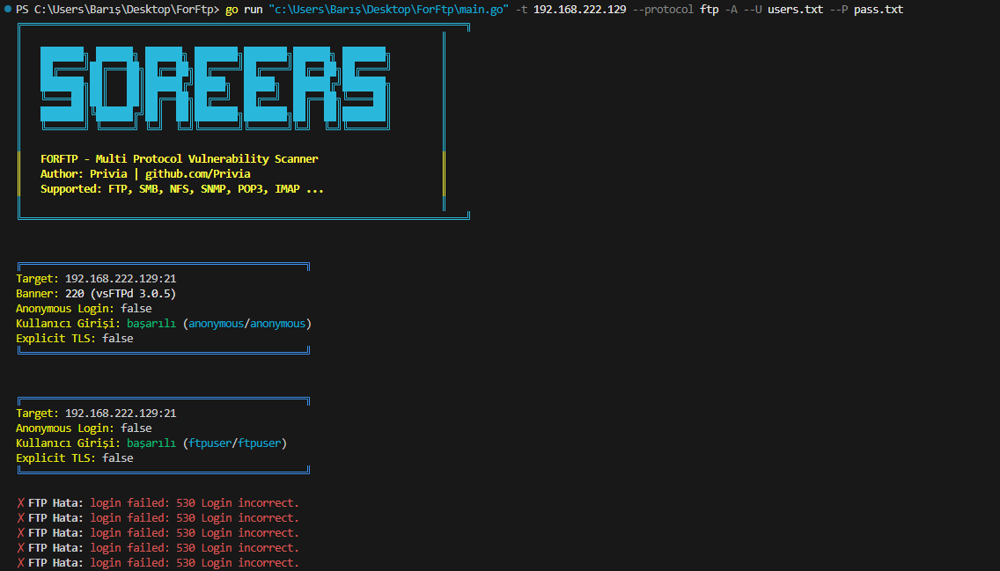
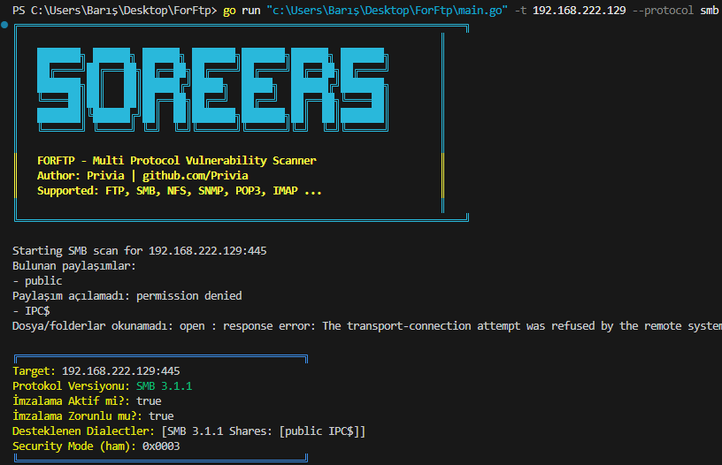
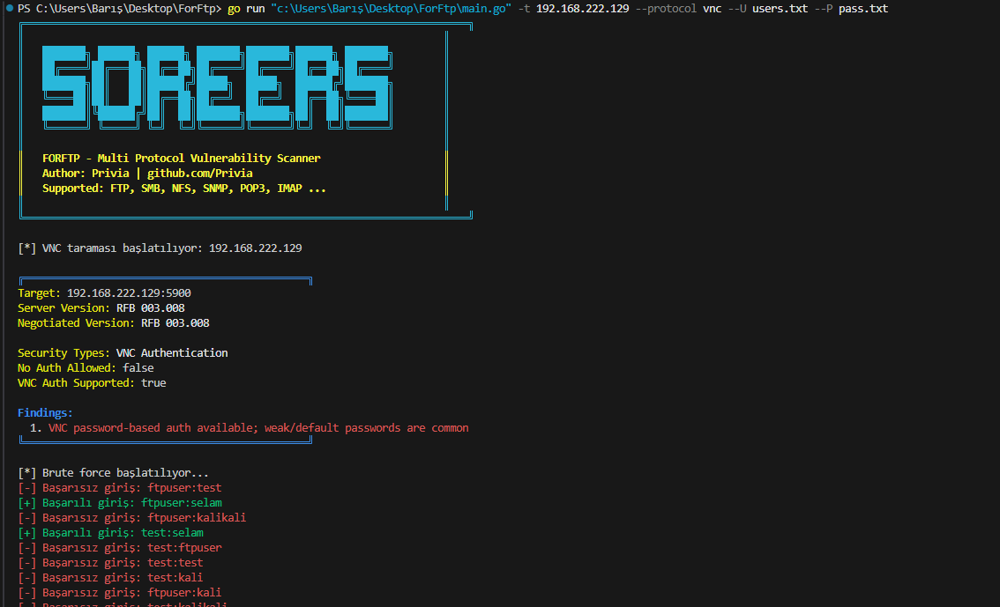
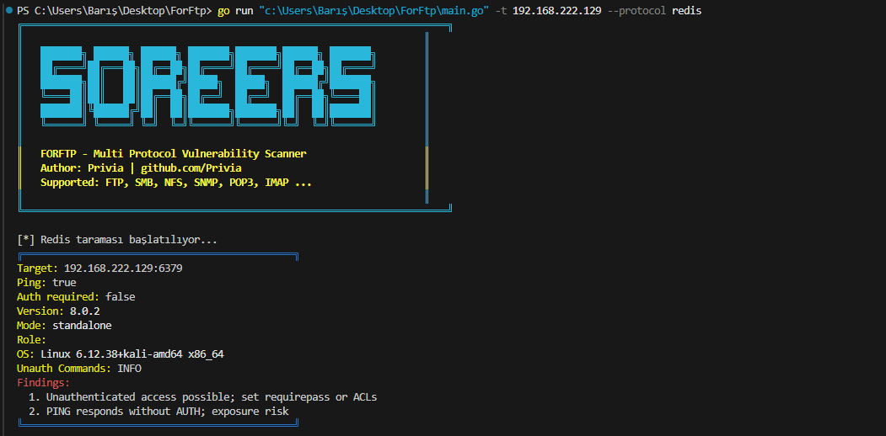
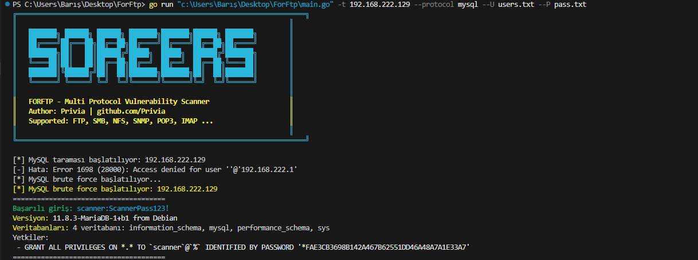
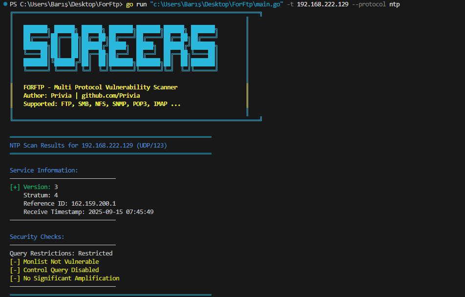

# FORFTP — Modular Vulnerability Scanner

FORFTP is a **modular vulnerability scanner** written in Go, designed to assess internal network security.  
It identifies misconfigurations, weak credentials, and insecure deployments across multiple common protocols.

---

##  Features
- Modular design — each protocol has its own scanner
- Brute-force authentication support
- Banner grabbing & version detection
- Permission & configuration checks
- TLS/SSL security analysis
- Detailed logging and colored CLI output

---

##  Supported Protocols
Each protocol has its own documentation in [`protocol_docs/`](ForFtp/protocol_docs):

- FTP
- SMB
- NFS
- SNMP
- LDAP
- IMAP
- POP3
- Redis
- MySQL
- Telnet
- SIP
- VNC
- NTP
- IPMI


---
##  Demo
You can watch the short helping menu  here:  

➡ 


---
##  Example Outputs

Below are some sample outputs for different protocol scans.

### FTP


### IMAP


### NFS


### POP3


### SMB (Example 1)


### SMB (Example 2)


### VNC


### Redis


### MySQL


### LDAP


### NTP



---

##  Usage
```bash
# General syntax
go run main.go --protocol <protocol> -t <target> [options]

# Example: LDAP brute-force with wordlists
go run main.go --protocol ldap -t 192.168.222.129 --U users.txt --P pass.txt

# Example: SMB scan with anonymous login
go run main.go --protocol smb -t 192.168.1.10 -A


Options:

--protocol : Select protocol (ftp, smb, ldap, etc.)

-t : Target IP

-T : File with target list

-u / -p : Single username / password

-U / -P : Wordlists for brute-force

-A : Test anonymous login

-c : Concurrent workers

-timeout : Connection timeout

---
