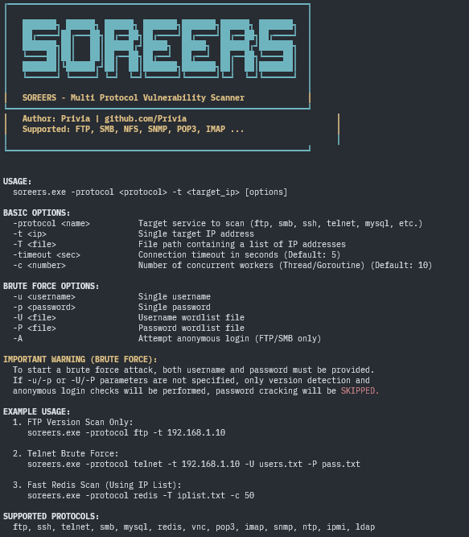

# FORFTP — Modular Vulnerability Scanner

FORFTP is a **modular vulnerability scanner** written in Go, designed to assess internal network security.  
It identifies misconfigurations, weak credentials, and insecure deployments across multiple common protocols.

---

##  Features
- Modular design — each protocol has its own scanner
- Brute-force authentication support
- Banner grabbing & version detection
- Permission & configuration checks
- TLS/SSL security analysis
- Detailed logging and colored CLI output

---

##  Supported Protocols
Each protocol has its own documentation in [`protocol_docs/`](Soreers/protocol_docs):

- FTP
- SMB
- NFS
- SNMP
- LDAP
- IMAP
- POP3
- Redis
- MySQL
- Telnet
- SIP
- VNC
- NTP
- IPMI

